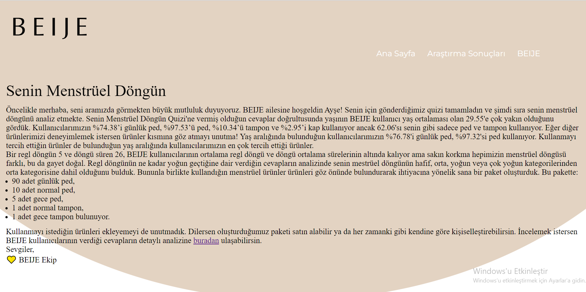
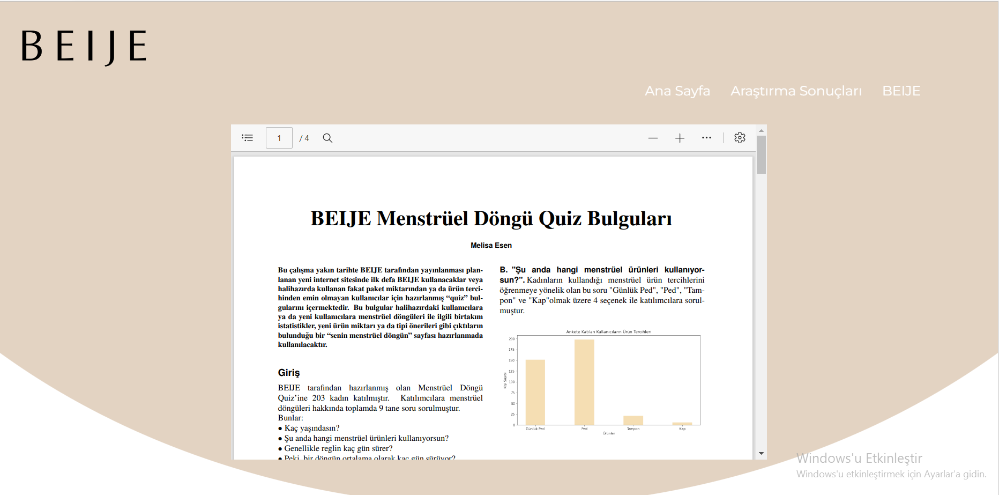
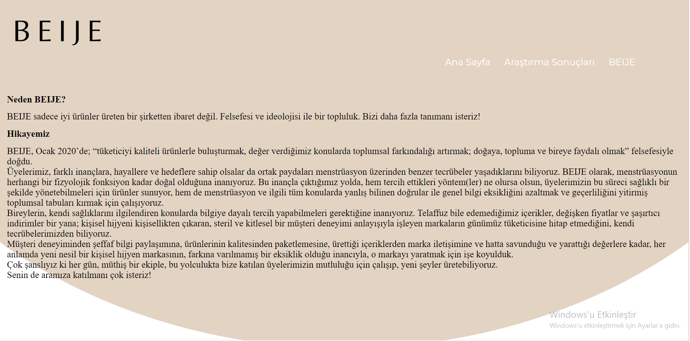

# BEIJE
### Data Analytics & Business Intelligence Intern Assignment
__**Task 1**__ Menstrüel Döngü Quiz’i

- a) Veri toplamak adına çeşitli demografik arka plana sahip 200’e yakın BEIJE kullanıcısına Menstrüel Döngü Quiz’i sorularını bir anketle sorduk. Bu anketin yanıtlarını analiz etmeni ve çıkarabileceğin bulguları (insightları) bizlerle kendi karar vereceğin bir format ile paylaşmanı, ve aşağıdaki örnek kullanıcı için bir “senin menstrüel döngün” sayfası oluşturmanı bekliyoruz. Bu noktada tasarımdan daha çok, kullanıcıya sunacağın rakamlar ve istatikler çok daha önemli. Kullanıcıya sunmayı planladığın metriklere kendin karar verebilirsin, bu sayede yaratıcı olmanı da teşvik etmeyi hedefliyoruz. Dataset’e bu bağlantıdan ulaşabilirsin. Regl döngüsü ile ilgili istatistikler adına sadece dataset’e bağlı kalmak zorunda değilsin; başka kaynaklar (Türkiye regl istatistikleri gibi) ile çalışmanı zenginleştirebilirsin.
 
 

*Tanış*: **Ayşe**  
Ayşe 28 yaşında ve şu anda sadece ped kullanıyor. Genellikle regli 5 gün sürüyor ve sırasıyla günlerinin
yoğunluğu hafif, yoğun, yoğun, orta, hafif olarak geçiyor. Bir regl döngüsü* ise ortalama olarak 26 gün
sürüyor. Regl olduğu tipik bir günde 2 normal ped ve 1 gece pedi kullanıyor. Günlük pedi her gün
kullanıyor, ve bir günde kullandığı ortalama ped sayısı ise 3. Ped, günlük ped ve tampon ise kullanmayı
dileyeceği menstrüel ürünler.

- b) Ayşe’nin döngüsünü; hafif, orta, yoğun veya çok yoğun kategorilerinden hangisine dahil
edersin? Bu kategorileri belirlemeni, belirleme sürecindeki aşamalarını ve istatiksel
yöntem ve değerleri detaylı bir şekilde açıklamanı isteyeceğiz.
- c) “Dataset”teki ürün kullanımlarını ele alarak, Ayşe’ye öneri paketler oluşturmanı; ve bu
öneri paketleri oluşturacak algoritma üzerine çalışmanı isteyeceğiz.
 
 
 
 

__**Task 2**__  Supply Chain Analytics & Forecasting  
BEIJE, ürünlerini yurtdışından belirli aralıklarla, arz ve talep dengesini sağlayacak ileriye dönük “forecast”lar ile belirlerdiği tarih aralığı ve ürün miktarları ile ihraç etmekte. Bu bağlantıda
bulabileceğin dökümanın ikinci sekmesi, BEIJE’in geriye dönük aylık olarak ürün bazlı satışlarını ve dönem sonu stoklarını göstermekte. Bu veri ışığında, BEIJE için sipariş vermesi gereken miktar ve aralıklarla hakkında bir resim çizmeni istiyoruz.
 
 
 
 

__**Task 1**__ Menstrüel Döngü Quiz’i Cevaplar
- a) <https://github.com/melisaesenn/BEIJE/blob/master/WebSayfas%C4%B1/BEIJEQUIZRAPOR.pdf>
 
https://github.com/melisaesenn/BEIJE/tree/master/WebSayfas%C4%B1

 

 
 

 
 

- b) ve c) <https://github.com/melisaesenn/BEIJE/blob/master/BEIJETask1.ipynb>

__**Task 2**__ Supply Chain Analytics & Forecasting Cevap

- <https://github.com/melisaesenn/BEIJE/blob/master/BEIJETask2.ipynb>

